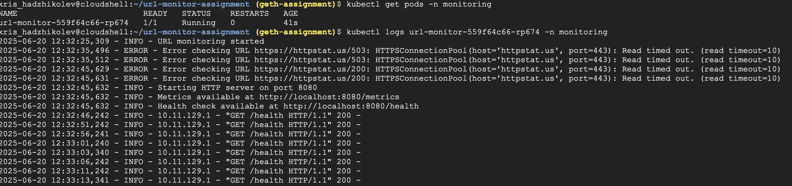
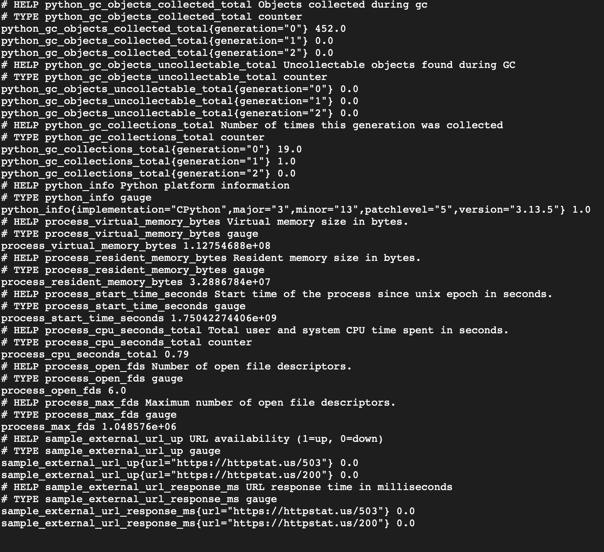

# URL Monitoring Assignment

## Running Locally and Deploying on Kubernetes
### Prerequisites 
- Python (ideally 3.13)
- pip
- helm
- Kubernetes environment already set up and already created cluster
- Docker

### Running Locally (with Virtual environment - venv)
#### Setting up the virtual environment
- Run `python3 -m venv venv` to create the environment 
- Run `source ./venv/bin/activate` for MacOS or `"venv\Scripts\activate"` for Windows OS to activate the environment
- Run `pip install -r requirements.txt` to install the required dependecies in the environment
#### Creating environment variable file (optional)
The http port and the check interval are setup as environment variables, which default to 8080 and 30 (seconds) respectively. To change them to custom values go through  the following steps:
- create .env file in the root directory
- Inside the file there should be two environment variables: `HTTP_PORT=[Numeric Value]` and `INTERVAL=[Numeric Value]`  
Example:  
   `INTERVAL=30`  
  `HTTP_PORT=8080`
#### Starting the application
- Run `python main.py`
- Wait until the HTTP server starts and generates the prometheus metrics then go to `localhost:<HTTP_PORT>/metrics`  
*Note: there is also `/health` path for general health check on the HTTP server.*
### Deploying in Kubernetes
#### (Re)Building the Docker image (optional)
There is already created public docker image (`krishum77/url-monitor-assignment`) in Docker Hub. The Dockerfile is available in the root directory and can be rebuilt and pushed to a different artifact repository with the following steps.
- Run `docker build -t <your-repository> .`
- Run `docker push <tag>`  
*Note 1: On MacOS there is an issue with architecture (amd64). In that case force architecture with --platform flag.*  
*Note 2: Default port in Dockerfile is 8080 and can be edited if needed.*
#### Deployment with Helm
The values.yaml file can be found in the *deployment* folder, if any changes are needed to the configuration e.g changing the docker repository or check interval.
- Make sure Kubernetes is running
- Run `helm install <application-name> ./deployment` or `helm install <application-name> ./deployment --namespace <your-namespace> --create-namespace` (recommended not to deploy in the default namespace)
- After the kubernetes service gets external IP address metrics can be accessed on `<external-ip>/metrics`
#### Uninstall Application
- Run `helm uninstall <application-name> -n <your-namespace>`

## General Notes 
- Right now httpstat.us is down - metrics are still running, but the response is always HTTP Code 503.
- There is a helm template for ingress, but givven the scope of the assignment it is currently disabled in values.yaml.
- The kubernetes service for the application is currently LoadBalancer so metrics can be accessed out of the cluster (without port-forwarding).
- The application has custom logging format.
- The application includes code comments for clarity.
## Screenshots
### Successfully Deployed on GKE

### Prometheus Metrics 

  
